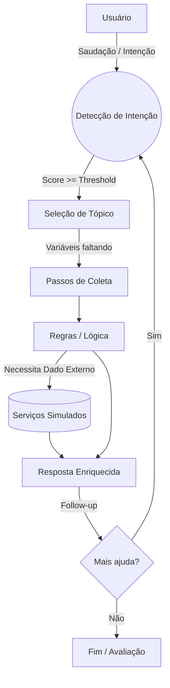
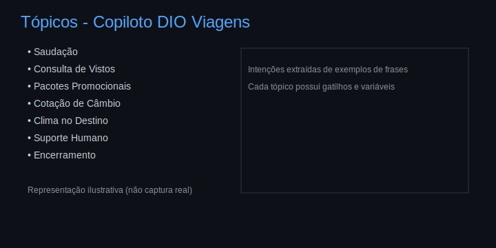
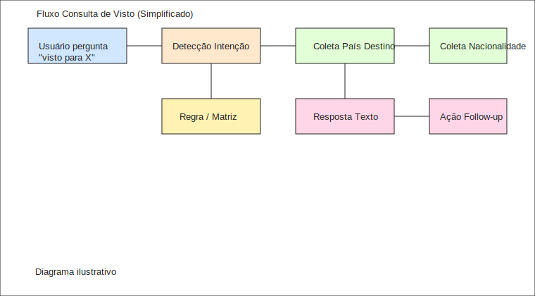
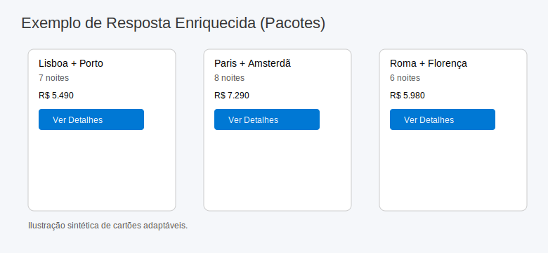
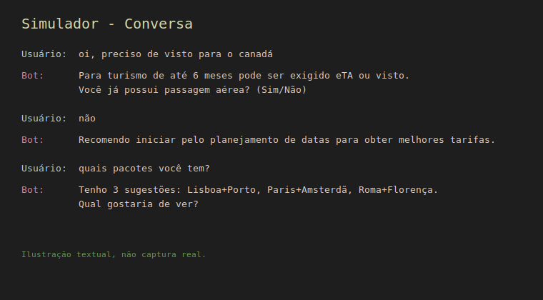
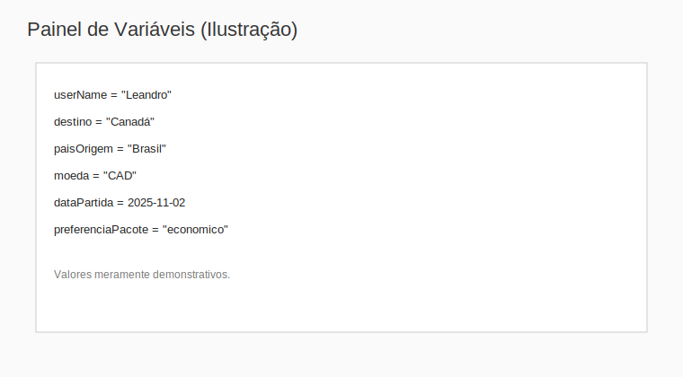

<div align="center">

# 🧭 Copiloto de Atendimento – DIO Viagens

Assistente virtual criado no **Microsoft Copilot Studio** para demonstrar, de ponta a ponta, como estruturar um copiloto conversacional para uma agência de viagens fictícia. Ele orienta clientes sobre destinos, vistos, pacotes, câmbio e suporte geral – com fluxos guiados, personalização e (simuladas) integrações externas.

🚀 Estado: MVP funcional (educacional / demonstrativo)

</div>

---

## 📌 Sumário

1. [Objetivos](#-objetivos)
2. [Arquitetura Lógica](#-arquitetura-lógica)
3. [Fluxo Principal (Visão Geral)](#-fluxo-principal-visão-geral)
4. [Principais Tópicos / Intenções](#-principais-tópicos--intenções)
5. [Exemplos de Conversa](#-exemplos-de-conversa)
6. [Variáveis e Contexto](#-variáveis-e-contexto)
7. [Integrações Externas (Simuladas)](#-integrações-externas-simuladas)
8. [Boas Práticas Aplicadas](#-boas-práticas-aplicadas)
9. [Como Reproduzir no Copilot Studio](#-como-reproduzir-no-copilot-studio)
10. [Capturas de Tela](#-capturas-de-tela)
11. [Possíveis Evoluções](#-possíveis-evoluções)
12. [Licença](#-licença)

---

## 🎯 Objetivos

| Objetivo | Descrição | Status |
|----------|-----------|--------|
| Estrutura Conversacional | Organizar tópicos e gatilhos de intenção | ✅ |
| Personalização | Uso de variáveis (nome, destino, datas) | ✅ |
| Automação | Respostas padronizadas para FAQs | ✅ |
| Integrações | Simulações de APIs (clima, câmbio, vistos) | ✅ (mock) |
| Escalabilidade | Separação por tópicos reutilizáveis | ✅ |
| Evolução | Base preparada para plugins / Power Automate | 🔄 Planejado |

---

## 🧱 Arquitetura Lógica



---

## 🔁 Fluxo Principal (Visão Geral)

1. Saudações detectam intenção genérica (ex: "Oi", "Quero viajar").
2. Pergunta foco: destino / tipo de suporte.
3. Redireciona para o tópico específico (vistos, pacotes, câmbio, clima, suporte humano).
4. Coleta variáveis necessárias (ex: país de destino, origem, datas).
5. (Opcional) Chama integração simulada para enriquecer dados.
6. Monta resposta adaptativa (texto + cartões/botões).
7. Oferece ações adicionais ou encerramento amigável.

---

## 🧩 Principais Tópicos / Intenções

| Tópico | Gatilhos (exemplos) | Objetivo | Saída Principal |
|--------|---------------------|----------|-----------------|
| Saudação | oi, olá, bom dia | Acolher e orientar | Menu inicial |
| Consulta de Vistos | preciso de visto, visto para canada | Informar necessidade básica | Resultado + link oficial |
| Pacotes Promocionais | promoções, pacotes baratos | Listar pacotes mock | Cards com 3 ofertas |
| Cotação de Câmbio | câmbio dólar, cotação euro | Mostrar taxa simulada | Valor + dicas |
| Clima no Destino | clima paris, tempo em lisboa | Prever clima (mock) | Temperatura + recomendação |
| Suporte Humano | falar com atendente | Escalar atendimento | Encaminhamento |
| Encerramento | obrigado, valeu | Finalizar sessão | Mensagem + pesquisa |

---

## 💬 Exemplos de Conversa

### 1. Consulta de Visto
**Usuário:** preciso de visto para canadá
**Bot:** Para brasileiros viajando ao Canadá para turismo de até 6 meses, é necessário solicitar eTA ou visto dependendo do tipo de entrada. Você já tem passagem aérea? (Sim/Não)

### 2. Pacotes Promocionais
**Usuário:** tem promoções para europa?
**Bot:** Encontrei 3 opções ideais para você (abril a junho):
1. Lisboa + Porto (7 noites) – R$ 5.490
2. Paris + Amsterdã (8 noites) – R$ 7.290
3. Roma + Florença (6 noites) – R$ 5.980
Deseja ver detalhes de alguma? (1/2/3)

### 3. Clima
**Usuário:** clima em paris
**Bot:** Paris esta semana: média 18°C / 11°C mínima. Recomendo levar um casaco leve e guarda-chuva. Quer saber sobre câmbio ou pacotes?

---

## 🧮 Variáveis e Contexto

| Variável | Tipo | Fonte | Uso |
|----------|------|-------|-----|
| userName | Texto | Pergunta inicial ou canal | Personalização |
| destino | Texto | Pergunta direta | Roteamento / Clima / Visto |
| paisOrigem | Texto | Pergunta ou default (Brasil) | Visto |
| moeda | Texto | Inferida do destino | Câmbio |
| dataPartida | Data | Input usuário | Recomendações |
| preferenciaPacote | Enum | Seleção | Filtrar ofertas |

---

## 🔌 Integrações Externas (Simuladas)

| Serviço | Propósito | Exemplo de Retorno (mock) |
|---------|----------|---------------------------|
| API Clima | Temperatura / condição | { "temp": 18, "cond": "nublado" } |
| API Câmbio | Taxa de moeda | { "USD_BR": 5.14, "EUR_BR": 5.55 } |
| API Vistos | Regras gerais | { "brasil->canada": "eTA ou Visto" } |

Sugestão real: integrar via Power Automate ou conectores personalizados.

---

## 🧠 Boas Práticas Aplicadas

* Divisão de tópicos por intenção clara.
* Reuso de subfluxos para coletar dados comuns (destino, datas).
* Mensagens curtas + follow-up opcional.
* Tratamento de intents ambíguas (pergunta de clarificação).
* Fallback configurado (3 tentativas -> encaminhar humano).
* Uso de variáveis para reduzir repetição de perguntas.

---

## 🛠 Como Reproduzir no Copilot Studio

1. Criar novo copiloto e definir idioma PT-BR.
2. Configurar tópicos listados (usar gatilhos nas tabelas acima).
3. Criar variáveis globais (userName, destino, paisOrigem...).
4. Implementar fluxos: coleta -> validação -> resposta.
5. (Opcional) Adicionar cartões adaptáveis para pacotes.
6. Simular integrações com ações de variável (atribuir JSON mock).
7. Testar no chat interno e registrar capturas.
8. Publicar versão e ativar canal desejado (Teams / Website).

### Exemplo de Pseudo-lógica (Câmbio)
```pseudo
IF (moeda não definida) -> inferir pela variável destino
Buscar taxa (mock JSON)
Calcular valor aproximado para 1.000 unidades
Responder com dicas de variação e segurança
```

---

## 🖼 Capturas de Tela / Ilustrações

As ilustrações SVG geradas automaticamente estão na pasta `docs/imagens/`. Substitua por capturas reais (PNG/JPG) se desejar manter evidências do ambiente; basta reutilizar os mesmos nomes ou ajustar os caminhos abaixo.

### Como Capturar & Subir
1. Abra a tela desejada no Microsoft Copilot Studio.
2. Pressione `Win + Shift + S` e selecione a área (Ferramenta de Recorte).
3. Cole (`Ctrl + V`) em um editor de imagem (ou direto no Explorer se usar o recurso de colar arquivo) e salve dentro de `docs/images/` com o nome correspondente.
4. No terminal (na raiz do repo):
	```bash
	git add docs/images
	git commit -m "docs(images): adiciona screenshots"
	git push origin main
	```
5. Atualize o README se mudar nomes/ordem.

### Tabela Resumida
| Descrição | Arquivo (SVG) | Visual |
|-----------|---------------|--------|
| Visão geral dos tópicos criados | `topics.svg` |  |
| Fluxo completo do tópico de visto | `fluxo-visto.svg` |  |
| Card / resposta enriquecida com pacotes | `card-pacotes.svg` |  |
| Teste no simulador interno | `simulador.svg` |  |
| Variáveis sendo preenchidas | `variaveis.svg` |  |

### Versão com Seções Individuais (opcional)
Você pode remover a tabela acima e usar blocos separados como abaixo quando as imagens existirem, para permitir legendas mais ricas:

#### 1. Visão Geral dos Tópicos

Legenda: Lista de tópicos com intenções e ícones de status de publicação.

#### 2. Fluxo de Consulta de Visto

Legenda: Exemplo de sequência de coleta de destino, nacionalidade e retorno de regra.

#### 3. Resposta Enriquecida (Pacotes)

Legenda: Uso de cartões adaptáveis simulando três ofertas com CTA.

#### 4. Teste no Simulador

Legenda: Conversa real demonstrando fallback e follow-up.

#### 5. Variáveis em Execução

Legenda: Painel lateral mostrando persistência de contexto.

> Se as imagens não aparecerem no GitHub: confirme com `git ls-files docs/imagens`.

---

## 🔮 Possíveis Evoluções

| Ideia | Benefício |
|-------|-----------|
| Integração real com API de clima | Respostas dinâmicas |
| Banco de dados de históricos | Personalização contínua |
| Análise de sentimentos | Priorização de atendimento humano |
| Plugin de reserva (Power Automate) | Fluxo transacional |
| Suporte multilíngue | Expansão de mercado |
| Geração de itinerário PDF | Valor agregado ao usuário |

---

## 📄 Licença

Distribuído sob a licença **MIT**. Consulte o arquivo `LICENSE` para detalhes.

---

## ✅ Conclusão

Este repositório mostra passo a passo a modelagem de um copiloto de atendimento para viagens, incluindo fluxos, variáveis, exemplos e caminhos de evolução. Serve como base modular para expandir rapidamente soluções de atendimento automatizado em cenários reais.

Se este material te ajudou, considere marcar uma estrela (⭐) e compartilhar!

---

Feito com foco em aprendizado e boas práticas de UX conversacional.

― Autor: Leandro da Silva Stampini